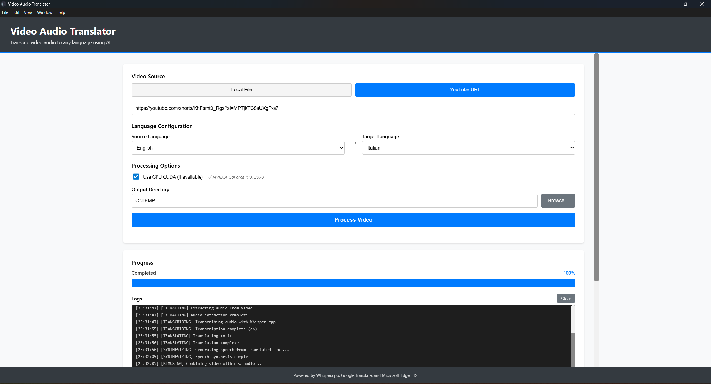

# Video Audio Translator

Un'applicazione desktop per tradurre l'audio dei video utilizzando riconoscimento vocale AI, traduzione e sintesi vocale.

[🇬🇧 English Version](README.md) | [📋 Informativa Privacy](PRIVACY.it.md)

## Caratteristiche

- 🎥 **Supporto Video YouTube** - Scarica ed elabora video direttamente da YouTube
- 🎙️ **Riconoscimento Vocale AI** - Alimentato da Whisper.cpp con accelerazione GPU CUDA
- 🌍 **Traduzione Automatica** - Traduci l'audio in più lingue usando Google Translate
- 🗣️ **Sintesi Vocale Neurale** - Voce naturale con Microsoft Edge TTS
- ⚡ **Accelerazione GPU** - Supporto CUDA per trascrizioni più veloci (GPU NVIDIA)
- 🎯 **Lip-Sync Ancorato ai Timestamp** - Ogni frase viene tradotta singolarmente e parte quando l'oratore la pronuncia, rispettando le sue pause
- 🎬 **Elaborazione Video** - Sincronizzazione automatica audio/video mantenendo qualità originale

## Interfaccia Utente



L'applicazione presenta un'interfaccia intuitiva con:
- Selezione sorgente video (File Locale o URL YouTube)
- Configurazione lingue (lingua sorgente e destinazione)
- Toggle accelerazione GPU CUDA con rilevamento automatico
- Selezione directory output
- Monitoraggio progresso in tempo reale
- Log dettagliati dell'elaborazione

## Requisiti

### Requisiti di Sistema
- **Sistema Operativo**: Windows 10/11 (64-bit)
- **RAM**: 4GB minimo, 8GB consigliati
- **Spazio su Disco**: 2GB di spazio libero per i modelli e l'elaborazione
- **GPU** (opzionale): GPU NVIDIA con supporto CUDA 12.6.0 per trascrizioni più veloci

### Requisiti Software
- **Node.js**: v22.12 o superiore
- **FFmpeg**: Richiesto per l'elaborazione video
- **Visual C++ Redistributable**: 2015-2022 (solitamente pre-installato su Windows)

## Installazione

### 1. Installare Node.js
Scarica e installa Node.js da [nodejs.org](https://nodejs.org/)

### 2. Installare FFmpeg
Scarica FFmpeg da [ffmpeg.org](https://ffmpeg.org/download.html) e aggiungilo al PATH di sistema.

Per verificare l'installazione, esegui:
```bash
ffmpeg -version
```

### 3. Clonare il Repository
```bash
git clone https://github.com/yourusername/video-translator.git
cd video-translator
```

### 4. Installare le Dipendenze
```bash
npm install
```

### 5. Scaricare Modello Whisper e Binari CUDA (Setup Automatico)

**Metodo Facile - Setup Completamente Automatico:**
```bash
# Scarica binari CUDA + modello medium consigliato automaticamente
npm run setup

# Oppure scarica binari CUDA + modello specifico
npm run setup:tiny     # Più veloce (75 MB)
npm run setup:base     # Veloce (142 MB)
npm run setup:small    # Bilanciato (466 MB)
npm run setup:medium   # Migliore qualità (1.5 GB) - Consigliato
npm run setup:large    # Qualità massima (3.1 GB)
```

Lo script di setup eseguirà automaticamente:
1. **Verifica binari CUDA** (whisper.dll e DLL CUDA)
2. **Scarica binari mancanti** dai rilasci ufficiali Whisper.cpp (~15 MB)
3. **Estrae e installa** nella directory `whisper-bin/`
4. **Scarica il modello AI Whisper selezionato**
5. **Verifica supporto GPU** e installazione
6. **Mostra progresso** durante tutti i download

**Nessun intervento manuale richiesto!** Lo script gestisce tutto.

**Metodo Manuale (Alternativo):**
```bash
# Visita: https://huggingface.co/ggerganov/whisper.cpp/tree/main
# Scarica: ggml-medium.bin
# Posizionalo in: whisper-bin/models/ggml-medium.bin
```

**Alternativa PowerShell per Windows:**
```powershell
# Esegui lo script PowerShell di setup
.\scripts\setup-whisper.ps1 -Model medium
```

### 6. Supporto GPU (Opzionale)
Se hai una GPU NVIDIA con supporto CUDA, l'applicazione la userà automaticamente per trascrizioni più veloci. Lo script di setup (`npm run setup`) scarica e installa automaticamente i binari Whisper.cpp con CUDA richiesti.

Per verificare il supporto GPU:
- Lo script di setup mostrerà "✓ NVIDIA GPU detected!" durante l'installazione
- L'applicazione mostrerà "✓ CUDA GPU rilevata" nell'interfaccia
- Controlla l'utilizzo GPU durante la trascrizione usando Task Manager

**Requisiti per accelerazione GPU:**
- GPU NVIDIA con CUDA Compute Capability 3.0+
- Driver NVIDIA 522.06 o più recente
- Windows 10/11 64-bit

## Utilizzo

### Avviare l'Applicazione

#### Modalità Sviluppo
```bash
npm start
```

#### Build per Produzione
```bash
npm run build
npm run electron
```

### Elaborare un Video

1. **Seleziona Sorgente Video**
   - Scegli "YouTube URL" e incolla un link YouTube, OPPURE
   - Scegli "File Locale" e sfoglia per selezionare un file video

2. **Configura Impostazioni**
   - **Lingua Sorgente**: Seleziona la lingua audio originale o usa "Rilevamento Automatico"
   - **Lingua Destinazione**: Seleziona la lingua in cui tradurre
   - **Usa GPU CUDA**: Abilita per elaborazione più veloce (se hai una GPU NVIDIA)
   - **Directory Output**: Scegli dove salvare il video tradotto

3. **Avvia Elaborazione**
   - Clicca "Avvia Elaborazione"
   - Monitora il progresso in tempo reale
   - Il processo include:
     - Download video (se YouTube)
     - Estrazione audio
     - Riconoscimento vocale (Whisper.cpp)
     - Traduzione (Google Translate)
     - Sintesi vocale (Microsoft Edge TTS)
     - Remux video con nuovo audio

4. **Output**
   - Il video tradotto sarà salvato nella directory output
   - Formato nome file: `video_translated_to_{lingua}.mp4`

### Analisi dei Risultati

Dopo aver elaborato un video, puoi analizzare la sincronizzazione usando lo script di analisi incluso:

```bash
node analyze-results.js
```

Questo script:
- Trova automaticamente il file di log più recente
- Mostra quante frasi sono state tradotte e quanti confini sono stati spostati sulle pause reali
- Mostra come sono state adattate le frasi (risintetizzate più veloci, time-stretch, intervallo di tempo)
- Riporta il ritardo massimo e medio delle frasi rispetto al parlato originale
- Fornisce un chiaro indicatore successo/fallimento basato sul ritardo massimo:
  - ✅ **SUCCESSO**: ogni frase parte entro 0,5 s dall'originale
  - ⚠️ **VICINO**: alcune frasi partono fino a 1,5 s in ritardo
  - ❌ **DA MIGLIORARE**: alcune frasi partono con più di 1,5 s di ritardo

**Esempio output** (lo script stampa in inglese):
```
=== Analyzing Latest Test Results ===

🌍 Translation:
  Whisper segments: 125
  Phrases translated: 75

⏸️  Source pauses:
  Silence threshold: -34dB
  Pauses detected: 66
  Boundaries snapped: 39

🗣️  Synthesis:
  Phrases placed: 75
  Re-synthesized faster: 41
  Time-stretched: 14 (tempo 0.90-1.08)

⏱️  Timing:
  Max phrase delay: 0.08s
  Avg phrase delay: 0.002s
  Overrun at end: 0.00s

✅ SUCCESS - Every phrase starts within 0.5s of the original
```

Per confrontare con metriche oggettive le modifiche all'allineamento lip-sync su un video fisso, usa il banco di prova: vedi [scripts/lipsync-bench/README.md](scripts/lipsync-bench/README.md) (in inglese).

## Lingue Supportate

L'applicazione supporta tutte le lingue disponibili in Google Translate, incluse:

- Inglese (en)
- Italiano (it)
- Spagnolo (es)
- Francese (fr)
- Tedesco (de)
- Portoghese (pt)
- Russo (ru)
- Giapponese (ja)
- Cinese (zh-CN, zh-TW)
- Arabo (ar)
- E molte altre...

## Struttura del Progetto

```
video-translator/
├── src/
│   ├── main.ts              # Processo principale Electron
│   ├── preload.ts           # Script preload Electron
│   ├── backend/             # Servizi backend
│   │   ├── server.ts        # Server Express + Socket.IO
│   │   ├── services/        # Servizi core
│   │   │   ├── WhisperService.ts      # Riconoscimento vocale
│   │   │   ├── TranslationService.ts  # Traduzione
│   │   │   ├── TTSService.ts          # Text-to-speech
│   │   │   ├── VideoRemux.ts          # Elaborazione video
│   │   │   └── VideoProcessor.ts      # Orchestratore principale
│   │   └── controllers/     # Controller API
│   ├── renderer/            # Frontend React
│   │   ├── App.tsx          # Componente principale app
│   │   ├── components/      # Componenti UI
│   │   └── hooks/           # Hook React
│   └── shared/              # Tipi condivisi
├── whisper-bin/             # Binari Whisper.cpp
│   └── models/              # Modelli Whisper
├── temp/                    # File temporanei elaborazione
└── output/                  # Directory output predefinita
```

## Come Funziona

### Panoramica del Processo

```
┌─────────────────────────────────────────────────────────────────────┐
│                   PIPELINE TRADUZIONE VIDEO                         │
└─────────────────────────────────────────────────────────────────────┘

INPUT: File Video o URL YouTube
   │
   ▼
┌─────────────────────────────────────────────────────────────────────┐
│ 1. ACQUISIZIONE VIDEO                                               │
│    • YouTube: yt-dlp scarica il video                               │
│    • Locale: Valida il formato file                                 │
└─────────────────────────────────────────────────────────────────────┘
   │
   ▼
┌─────────────────────────────────────────────────────────────────────┐
│ 2. ESTRAZIONE AUDIO                                                 │
│    • FFmpeg estrae la traccia audio                                 │
│    • Converte in WAV mono 16kHz                                     │
│    • Ottimizzato per input Whisper.cpp                              │
└─────────────────────────────────────────────────────────────────────┘
   │
   ▼
┌─────────────────────────────────────────────────────────────────────┐
│ 3. RICONOSCIMENTO VOCALE (Whisper.cpp + CUDA)                       │
│    • Carica modello GGML (tiny/base/small/medium/large)             │
│    • Accelerazione GPU via CUDA 12.6.0 (se disponibile)             │
│    • Estrae testo con timestamp a livello di frase                  │
│    • Rileva automaticamente la lingua sorgente                      │
│    Output: Testo trascritto nella lingua originale                  │
└─────────────────────────────────────────────────────────────────────┘
   │
   ▼
┌─────────────────────────────────────────────────────────────────────┐
│ 4. TRADUZIONE (Google Translate API)                                │
│    • Raggruppa i segmenti Whisper in frasi (divise alle pause)      │
│    • Traduce frase per frase, in poche richieste a blocchi          │
│    • Ogni frase tradotta mantiene i suoi timestamp originali        │
│    • Retry automatico con exponential backoff                       │
│    Output: Frasi tradotte con i rispettivi tempi di inizio/fine     │
└─────────────────────────────────────────────────────────────────────┘
   │
   ▼
┌────────────────────────────────────────────────────────────────────┐
│ 5. SINTESI TEXT-TO-SPEECH (Microsoft Edge TTS)                     │
│    ┌─────────────────────────────────────────────────────────────┐ │
│    │ a) Allineamento alle Pause Reali                            │ │
│    │    • I segmenti di Whisper.cpp sono contigui, quindi le     │ │
│    │      pause si rilevano nell'audio originale (soglia         │ │
│    │      adattiva al volume)                                    │ │
│    │    • I confini delle frasi si spostano sulle pause          │ │
│    └─────────────────────────────────────────────────────────────┘ │
│    ┌─────────────────────────────────────────────────────────────┐ │
│    │ b) Sintesi Vocale Neurale                                   │ │
│    │    • Una chiamata Edge TTS per frase, 4 in parallelo        │ │
│    │    • Silenzio iniziale/finale del TTS rimosso               │ │
│    │    • Frasi troppo lunghe risintetizzate con rate Edge TTS   │ │
│    │      più veloce (fino a +40%, prosodia naturale)            │ │
│    └─────────────────────────────────────────────────────────────┘ │
│    ┌─────────────────────────────────────────────────────────────┐ │
│    │ c) Posizionamento Ancorato ai Timestamp                     │ │
│    │    • Ogni frase parte al suo istante assoluto originale     │ │
│    │    • Una frase può usare la pausa successiva prima di       │ │
│    │      essere accelerata; residuo con atempo (0,90x-1,15x)    │ │
│    │    • Una frase in ritardo sposta solo le successive fino    │ │
│    │      alla pausa seguente: gli errori non si accumulano      │ │
│    │    • Concatenazione esatta, allungata alla durata video     │ │
│    └─────────────────────────────────────────────────────────────┘ │
│    Output: Audio doppiato allineato al parlato originale           │
└────────────────────────────────────────────────────────────────────┘
   │
   ▼
┌─────────────────────────────────────────────────────────────────────┐
│ 6. REMUX VIDEO (FFmpeg)                                             │
│    • Sostituisce audio originale con audio tradotto                 │
│    • Stream video: copia (no re-encoding, preserva qualità)         │
│    • Stream audio: codec AAC, timing sincronizzato                  │
│    • Formato output: container MP4                                  │
└─────────────────────────────────────────────────────────────────────┘
   │
   ▼
OUTPUT: Video Tradotto (video_translated_to_{lingua}.mp4)
```

### Passaggi Dettagliati del Processo

1. **Download/Validazione Video**
   - Scarica il video da YouTube usando yt-dlp
   - Oppure valida il file video locale

2. **Estrazione Audio**
   - Estrae la traccia audio dal video usando FFmpeg
   - Converte in formato WAV 16kHz per Whisper

3. **Riconoscimento Vocale**
   - Elabora l'audio con Whisper.cpp (modello medium)
   - Estrae il testo con timestamp delle frasi
   - Rileva automaticamente la lingua se non specificata

4. **Traduzione**
   - Raggruppa i segmenti Whisper in frasi, dividendo alle pause e oltre i 12 s
   - Traduce ogni frase con Google Translate, a blocchi (una richiesta ogni ~4500 caratteri)
   - Ogni frase tradotta mantiene i timestamp del parlato che sostituisce, così il doppiaggio dice la cosa giusta al momento giusto
   - Retry automatico con exponential backoff

5. **Text-to-Speech con Lip-Sync Ancorato ai Timestamp**
   - Rileva le pause reali dell'oratore nell'audio originale (la soglia si adatta al volume, così la musica di sottofondo non le nasconde) e sposta lì i confini delle frasi
   - Sintetizza ogni frase con le voci neurali Microsoft Edge TTS (4 richieste in parallelo), rimuovendo il silenzio che Edge TTS aggiunge attorno al parlato
   - Le frasi più lunghe del loro spazio vengono risintetizzate con un rate Edge TTS più veloce (fino a +40%), molto più naturale che stirare l'audio
   - Posiziona ogni frase al suo istante di inizio assoluto originale; una frase può estendersi nella pausa successiva prima di essere accelerata, e lo scarto residuo viene adattato con atempo entro 0,90x-1,15x
   - Una frase che resta lunga ritarda solo le successive finché la pausa seguente non assorbe il ritardo, quindi gli errori non si accumulano lungo il video
   - Concatenazione esatta al campione (senza crossfade che accorcerebbero la traccia), allungata alla durata esatta del video
   - Codifica UTF-8 corretta che preserva caratteri accentati (à,è,ì,ò,ù,é,á)

6. **Remux Video**
   - Combina video originale con audio tradotto
   - Mantiene la qualità video (copia codec)
   - Sincronizza timing audio/video

## Risoluzione Problemi

### GPU Non Rilevata
- Assicurati di avere una GPU NVIDIA con supporto CUDA
- Installa i driver NVIDIA più recenti
- È richiesto il supporto CUDA 12.6.0

### Traduzione Fallisce
- Controlla la connessione internet
- Se ricevi "Too Many Requests", aspetta qualche minuto
- L'app ha retry automatico con exponential backoff

### Errori FFmpeg
- Verifica che FFmpeg sia installato e nel PATH
- Esegui `ffmpeg -version` per controllare
- Su Windows, riavvia il terminale dopo aver aggiunto al PATH

### Elaborazione Lenta
- Abilita GPU CUDA per trascrizioni più veloci (10-20x più veloce)
- Usa video più piccoli per test
- Chiudi altre applicazioni intensive per GPU

### Problemi Voce TTS
- Microsoft Edge TTS usa voci neurali basate su cloud
- Non è richiesta alcuna installazione aggiuntiva
- Richiede connessione internet per la generazione TTS
- Supporta oltre 100 lingue con voci dal suono naturale

## Consigli Prestazioni

1. **Accelerazione GPU**: Abilita CUDA per trascrizioni 10-20x più veloci
2. **Selezione Modello**: Il modello medium offre il miglior bilanciamento velocità/qualità
3. **Elaborazione Batch**: Elabora un video alla volta per risultati migliori
4. **Spazio Disco**: Assicurati di avere spazio libero sufficiente (2x dimensione video + modelli)

## Limitazioni Note

- Il burning dei sottotitoli è attualmente disabilitato (sarà re-implementato in una versione futura)
- Richiede connessione internet per traduzione e generazione TTS
- Rate limiting Google Translate (gestito automaticamente con retry)

## Tecnologie Utilizzate

- **Electron 44.5** - Framework applicazione desktop
- **React 19.3** - Framework UI
- **TypeScript 6.0** - Sviluppo type-safe
- **Express 5.2** - Server backend
- **Socket.IO 4.8** - Comunicazione real-time
- **Whisper.cpp 1.6.2** - Riconoscimento vocale (CUDA 12.6.0)
- **FFmpeg** - Elaborazione video/audio
- **Google Translate API** - Servizio traduzione
- **Microsoft Edge TTS** - Sintesi vocale neurale text-to-speech

## Contribuire

I contributi sono benvenuti! Sentiti libero di inviare una Pull Request.

## Licenza

Questo progetto è rilasciato con licenza MIT - vedi il file LICENSE per i dettagli.

## Ringraziamenti

- [Whisper.cpp](https://github.com/ggerganov/whisper.cpp) - Implementazione veloce di Whisper di OpenAI
- [FFmpeg](https://ffmpeg.org/) - Framework multimedia
- [Google Translate](https://translate.google.com/) - Servizio traduzione
- [yt-dlp](https://github.com/yt-dlp/yt-dlp) - Downloader YouTube

## Supporto

Per problemi, domande o suggerimenti, apri un issue su GitHub.

## Supporta il Progetto

Se trovi utile questo progetto, considera di supportarne lo sviluppo:

[](https://paypal.me/sedoglia)

Il tuo supporto aiuta a mantenere e migliorare questo progetto open-source!

## Privacy

Questa applicazione rispetta la tua privacy. Tutta l'elaborazione video avviene localmente sul tuo dispositivo. Solo il testo (trascrizioni e traduzioni) è inviato a API di terze parti. Leggi la nostra [Informativa Privacy](PRIVACY.it.md) completa per dettagli sulla conformità GDPR e gestione dei dati.

---

Realizzato con ❤️ usando Electron, React e AI
