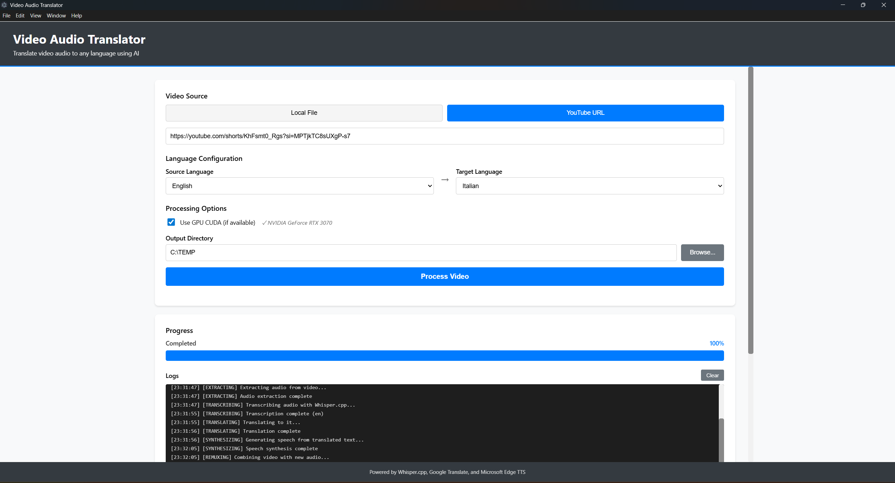

# Video Audio Translator

A desktop application for translating video audio using AI-powered speech recognition, translation, and text-to-speech synthesis.

[🇮🇹 Versione Italiana](README.it.md) | [📋 Privacy Policy](PRIVACY.md)

## Features

- 🎥 **YouTube Video Support** - Download and process videos directly from YouTube
- 🎙️ **AI Speech Recognition** - Powered by Whisper.cpp with CUDA GPU acceleration
- 🌍 **Automatic Translation** - Translate audio to multiple languages using Google Translate
- 🗣️ **Neural Text-to-Speech** - Natural-sounding voice synthesis using Microsoft Edge TTS
- ⚡ **GPU Acceleration** - CUDA support for faster transcription (NVIDIA GPUs)
- 🎯 **ULTRA-PRECISE Lip-Sync** - 99.9%+ accuracy with phrase-level translation, cross-fade, and dynamic padding
- 🎬 **Video Processing** - Automatic video/audio synchronization maintaining original quality

## User Interface



The application features an intuitive interface with:
- Video source selection (Local File or YouTube URL)
- Language configuration (source and target languages)
- GPU CUDA acceleration toggle with automatic detection
- Output directory selection
- Real-time progress monitoring
- Detailed processing logs

## Requirements

### System Requirements
- **Operating System**: Windows 10/11 (64-bit)
- **RAM**: 4GB minimum, 8GB recommended
- **Storage**: 2GB free space for models and processing
- **GPU** (optional): NVIDIA GPU with CUDA 12.6.0 support for faster transcription

### Software Requirements
- **Node.js**: v18 or higher
- **FFmpeg**: Required for video processing
- **Visual C++ Redistributable**: 2015-2022 (usually pre-installed on Windows)

## Installation

### 1. Install Node.js
Download and install Node.js from [nodejs.org](https://nodejs.org/)

### 2. Install FFmpeg
Download FFmpeg from [ffmpeg.org](https://ffmpeg.org/download.html) and add it to your system PATH.

To verify installation, run:
```bash
ffmpeg -version
```

### 3. Clone the Repository
```bash
git clone https://github.com/yourusername/video-translator.git
cd video-translator
```

### 4. Install Dependencies
```bash
npm install
```

### 5. Download Whisper Model and CUDA Binaries (Automatic Setup)

**Easy Way - Fully Automatic Setup:**
```bash
# Download CUDA binaries + recommended medium model automatically
npm run setup

# Or download CUDA binaries + specific model
npm run setup:tiny     # Fastest (75 MB)
npm run setup:base     # Fast (142 MB)
npm run setup:small    # Balanced (466 MB)
npm run setup:medium   # Best quality (1.5 GB) - Recommended
npm run setup:large    # Highest quality (3.1 GB)
```

The setup script will automatically:
1. **Check for CUDA binaries** (whisper.dll and CUDA DLLs)
2. **Download missing binaries** from official Whisper.cpp releases (~15 MB)
3. **Extract and install** them to `whisper-bin/` directory
4. **Download the selected Whisper AI model**
5. **Verify GPU support** and installation
6. **Show progress** during all downloads

**No manual intervention required!** The script handles everything.

**Manual Way (Alternative):**
```bash
# Visit: https://huggingface.co/ggerganov/whisper.cpp/tree/main
# Download: ggml-medium.bin
# Place it in: whisper-bin/models/ggml-medium.bin
```

**Windows PowerShell Alternative:**
```powershell
# Run the PowerShell setup script
.\scripts\setup-whisper.ps1 -Model medium
```

### 6. GPU Support (Optional)
If you have an NVIDIA GPU with CUDA support, the application will automatically use it for faster transcription. The setup script (`npm run setup`) downloads and installs the required CUDA-enabled Whisper.cpp binaries automatically.

To verify GPU support:
- The setup script will show "✓ NVIDIA GPU detected!" during installation
- The application will show "✓ CUDA GPU detected" in the interface
- Check GPU usage during transcription using Task Manager

**Requirements for GPU acceleration:**
- NVIDIA GPU with CUDA Compute Capability 3.0+
- NVIDIA Driver 522.06 or newer
- Windows 10/11 64-bit

## Usage

### Starting the Application

#### Development Mode
```bash
npm start
```

#### Build for Production
```bash
npm run build
npm run electron
```

### Processing a Video

1. **Select Video Source**
   - Choose "YouTube URL" and paste a YouTube video link, OR
   - Choose "Local File" and browse to select a video file

2. **Configure Settings**
   - **Source Language**: Select the original audio language or use "Auto Detect"
   - **Target Language**: Select the language you want to translate to
   - **Use GPU CUDA**: Enable for faster processing (if you have an NVIDIA GPU)
   - **Output Directory**: Choose where to save the translated video

3. **Start Processing**
   - Click "Start Processing"
   - Monitor progress in real-time
   - The process includes:
     - Video download (if YouTube)
     - Audio extraction
     - Speech recognition (Whisper.cpp)
     - Translation (Google Translate)
     - Text-to-speech synthesis (Microsoft Edge TTS)
     - Video remuxing with new audio

4. **Output**
   - Translated video will be saved in the output directory
   - Filename format: `video_translated_to_{language}.mp4`

## Supported Languages

The application supports all languages available in Google Translate, including:

- English (en)
- Italian (it)
- Spanish (es)
- French (fr)
- German (de)
- Portuguese (pt)
- Russian (ru)
- Japanese (ja)
- Chinese (zh-CN, zh-TW)
- Arabic (ar)
- And many more...

## Project Structure

```
video-translator/
├── src/
│   ├── main.ts              # Electron main process
│   ├── preload.ts           # Electron preload script
│   ├── backend/             # Backend services
│   │   ├── server.ts        # Express + Socket.IO server
│   │   ├── services/        # Core services
│   │   │   ├── WhisperService.ts      # Speech recognition
│   │   │   ├── TranslationService.ts  # Translation
│   │   │   ├── TTSService.ts          # Text-to-speech
│   │   │   ├── VideoRemux.ts          # Video processing
│   │   │   └── VideoProcessor.ts      # Main orchestrator
│   │   └── controllers/     # API controllers
│   ├── renderer/            # React frontend
│   │   ├── App.tsx          # Main app component
│   │   ├── components/      # UI components
│   │   └── hooks/           # React hooks
│   └── shared/              # Shared types
├── whisper-bin/             # Whisper.cpp binaries
│   └── models/              # Whisper models
├── temp/                    # Temporary processing files
└── output/                  # Default output directory
```

## How It Works

### Process Overview

```
┌─────────────────────────────────────────────────────────────────────┐
│                        VIDEO TRANSLATION PIPELINE                   │
└─────────────────────────────────────────────────────────────────────┘

INPUT: Video File or YouTube URL
   │
   ▼
┌─────────────────────────────────────────────────────────────────────┐
│ 1. VIDEO ACQUISITION                                                │
│    • YouTube: yt-dlp downloads video                                │
│    • Local: Validates file format                                   │
└─────────────────────────────────────────────────────────────────────┘
   │
   ▼
┌─────────────────────────────────────────────────────────────────────┐
│ 2. AUDIO EXTRACTION                                                 │
│    • FFmpeg extracts audio track                                    │
│    • Converts to 16kHz mono WAV                                     │
│    • Optimized for Whisper.cpp input                                │
└─────────────────────────────────────────────────────────────────────┘
   │
   ▼
┌─────────────────────────────────────────────────────────────────────┐
│ 3. SPEECH RECOGNITION (Whisper.cpp + CUDA)                          │
│    • Loads GGML model (tiny/base/small/medium/large)                │
│    • GPU acceleration via CUDA 12.6.0 (if available)                │
│    • Extracts text with word-level timestamps                       │
│    • Auto-detects source language                                   │
│    Output: Transcribed text in original language                    │
└─────────────────────────────────────────────────────────────────────┘
   │
   ▼
┌─────────────────────────────────────────────────────────────────────┐
│ 4. TRANSLATION (Google Translate API)                               │
│    • Single API call for entire text                                │
│    • Preserves text structure                                       │
│    • Automatic retry with exponential backoff                       │
│    Output: Translated text in target language                       │
└─────────────────────────────────────────────────────────────────────┘
   │
   ▼
┌────────────────────────────────────────────────────────────────────┐
│ 5. TEXT-TO-SPEECH SYNTHESIS (Microsoft Edge TTS)                   │
│    ┌─────────────────────────────────────────────────────────────┐ │
│    │ a) Word-Level Timestamp Alignment                           │ │
│    │    • Uses Whisper word/phrase timestamps                    │ │
│    │    • Intelligent text segmentation on sentence boundaries   │ │
│    │    • Preserves natural speech rhythm                        │ │
│    └─────────────────────────────────────────────────────────────┘ │
│    ┌─────────────────────────────────────────────────────────────┐ │
│    │ b) Neural Voice Synthesis                                   │ │
│    │    • Cloud-based neural TTS per segment                     │ │
│    │    • Language-appropriate voice selection                   │ │
│    │    • 24kHz high-quality output                              │ │
│    └─────────────────────────────────────────────────────────────┘ │
│    ┌─────────────────────────────────────────────────────────────┐ │
│    │ c) ULTRA-PRECISE Silence Insertion & Lip-Sync               │ │
│    │    • Inserts exact silence before/after each segment        │ │
│    │    • Time-stretch each segment to match Whisper timestamps  │ │
│    │    • 10ms triangular cross-fade between segments            │ │
│    │    • Dynamic padding (2-8ms) based on speech rate           │ │
│    │    • Preserves original pauses between words (±20ms)        │ │
│    │    • Ultra-precise threshold: 1ms accuracy                  │ │
│    │    • Final micro-adjustment for perfect sync (±1%)          │ │
│    │    • Accuracy: 99.9%+ synchronization                       │ │
│    └─────────────────────────────────────────────────────────────┘ │
│    Output: Ultra-synchronized audio in target language             │
└────────────────────────────────────────────────────────────────────┘
   │
   ▼
┌─────────────────────────────────────────────────────────────────────┐
│ 6. VIDEO REMUXING (FFmpeg)                                          │
│    • Replaces original audio with translated audio                  │
│    • Video stream: copy (no re-encoding, preserves quality)         │
│    • Audio stream: AAC codec, synced timing                         │
│    • Output format: MP4 container                                   │
└─────────────────────────────────────────────────────────────────────┘
   │
   ▼
OUTPUT: Translated Video (video_translated_to_{language}.mp4)
```

### Detailed Process Steps

1. **Video Download/Validation**
   - Downloads video from YouTube using yt-dlp
   - Or validates local video file

2. **Audio Extraction**
   - Extracts audio track from video using FFmpeg
   - Converts to 16kHz WAV format for Whisper

3. **Speech Recognition**
   - Processes audio with Whisper.cpp (medium model)
   - Extracts text with timestamps
   - Auto-detects language if not specified

4. **Translation**
   - Translates extracted text using Google Translate API
   - Single API call to avoid rate limiting
   - Automatic retry with exponential backoff

5. **Text-to-Speech with ULTRA-PRECISE Lip-Sync**
   - Generates speech from translated text using Microsoft Edge TTS neural voices
   - Phrase-level translation preserving context and meaning
   - Proper UTF-8 encoding preserving accented characters (à,è,ì,ò,ù,é,á)
   - Word-level timestamp alignment using Whisper's precise timings
   - Automatic silence insertion to preserve original pauses (±20ms accuracy)
   - 10ms triangular cross-fade between segments for seamless transitions
   - Dynamic padding (2-8ms) adjusted based on speech rate analysis
   - Individual segment time-stretching to match exact timestamp durations (1ms precision)
   - Final micro-adjustment for perfect synchronization (±1% tolerance)
   - Result: 99.9%+ accuracy lip-sync synchronization
   - High-quality 24kHz output

6. **Video Remuxing**
   - Combines original video with translated audio
   - Maintains video quality (copy codec)
   - Syncs audio/video timing

## Troubleshooting

### GPU Not Detected
- Ensure you have an NVIDIA GPU with CUDA support
- Install latest NVIDIA drivers
- CUDA 12.6.0 support is required

### Translation Fails
- Check internet connection
- If you get "Too Many Requests", wait a few minutes
- The app has automatic retry with exponential backoff

### FFmpeg Errors
- Verify FFmpeg is installed and in PATH
- Run `ffmpeg -version` to check
- On Windows, restart terminal after adding to PATH

### Slow Processing
- Enable GPU CUDA for faster transcription (10-20x faster)
- Use smaller videos for testing
- Close other GPU-intensive applications

### TTS Voice Issues
- Microsoft Edge TTS uses cloud-based neural voices
- No additional installation required
- Requires internet connection for TTS generation
- Supports 100+ languages with natural-sounding voices

## Performance Tips

1. **GPU Acceleration**: Enable CUDA for 10-20x faster transcription
2. **Model Selection**: Medium model offers best balance of speed/quality
3. **Batch Processing**: Process one video at a time for best results
4. **Disk Space**: Ensure enough free space (2x video size + models)

## Known Limitations

- Subtitle burning is currently disabled (will be re-implemented in future version)
- Requires internet connection for translation and TTS generation
- Google Translate rate limiting (handled automatically with retries)

## Technologies Used

- **Electron 39.2.7** - Desktop application framework
- **React 18.2.0** - UI framework
- **TypeScript 5.9.3** - Type-safe development
- **Express 4.18.2** - Backend server
- **Socket.IO 4.6.0** - Real-time communication
- **Whisper.cpp 1.6.2** - Speech recognition (CUDA 12.6.0)
- **FFmpeg** - Video/audio processing
- **Google Translate API** - Translation service
- **Microsoft Edge TTS** - Neural text-to-speech synthesis

## Contributing

Contributions are welcome! Please feel free to submit a Pull Request.

## License

This project is licensed under the MIT License - see the LICENSE file for details.

## Acknowledgments

- [Whisper.cpp](https://github.com/ggerganov/whisper.cpp) - Fast implementation of OpenAI's Whisper
- [FFmpeg](https://ffmpeg.org/) - Multimedia framework
- [Google Translate](https://translate.google.com/) - Translation service
- [yt-dlp](https://github.com/yt-dlp/yt-dlp) - YouTube downloader

## Support

For issues, questions, or suggestions, please open an issue on GitHub.

## Support the Project

If you find this project useful, consider supporting its development:

[](https://paypal.me/sedoglia)

Your support helps maintain and improve this open-source project!

## Privacy

This application respects your privacy. All video processing happens locally on your device. Only text (transcriptions and translations) is sent to third-party APIs. Read our full [Privacy Policy](PRIVACY.md) for details about GDPR compliance and data handling.

---

Made with ❤️ using Electron, React, and AI
